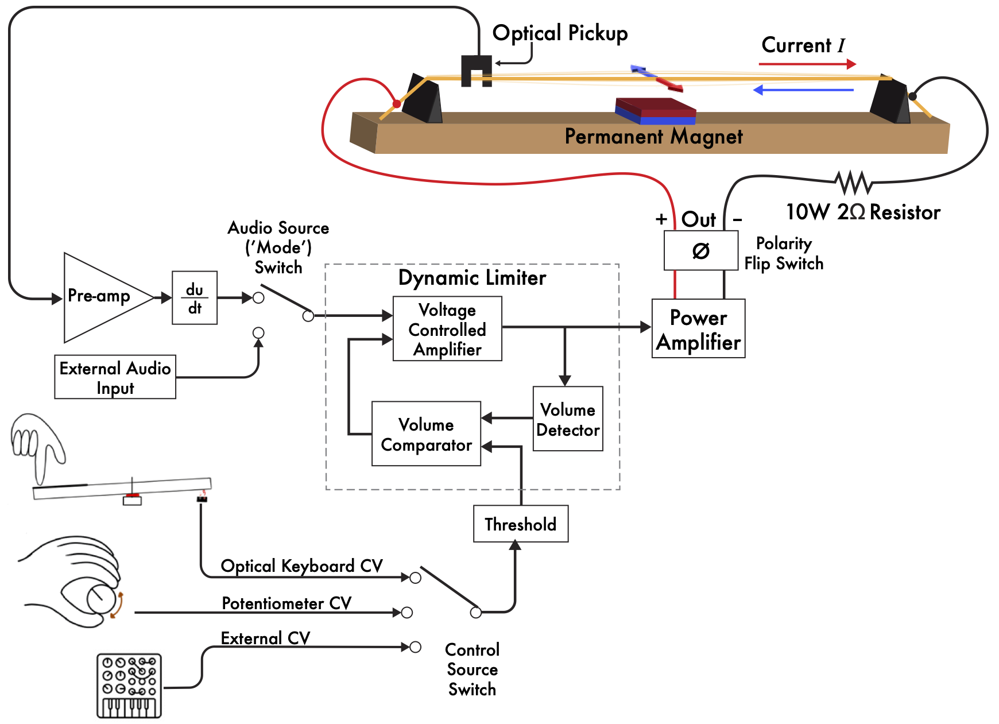
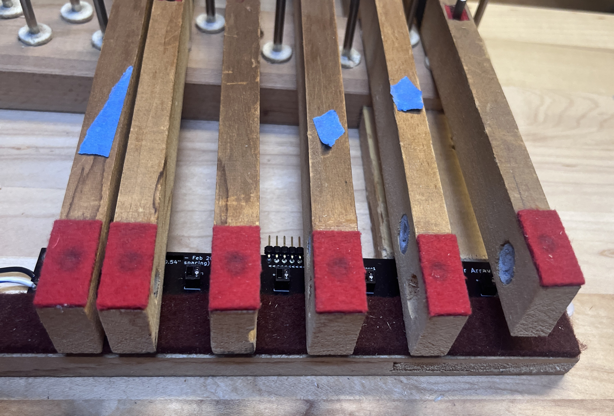
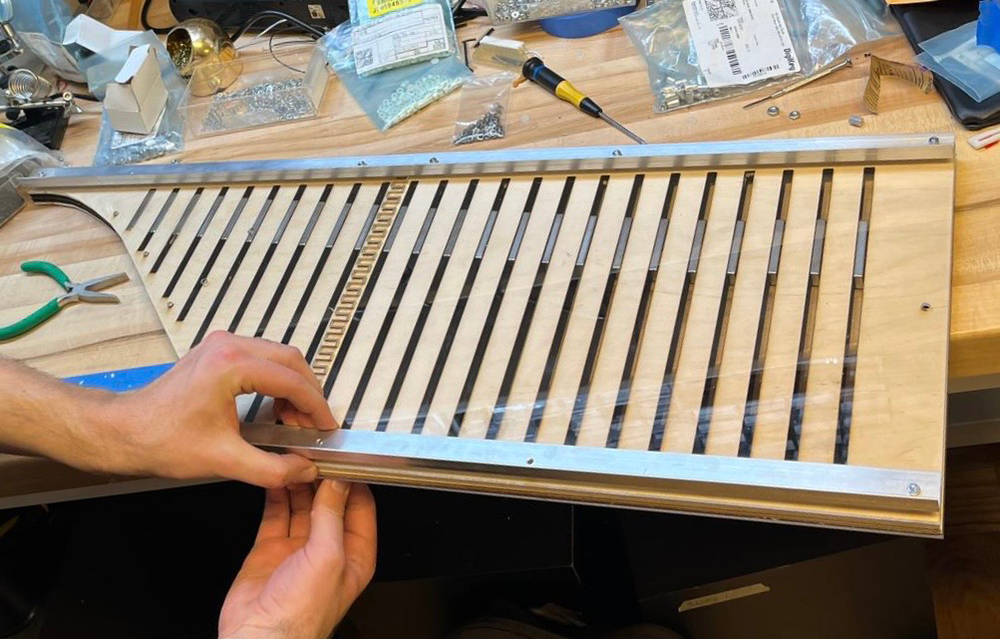
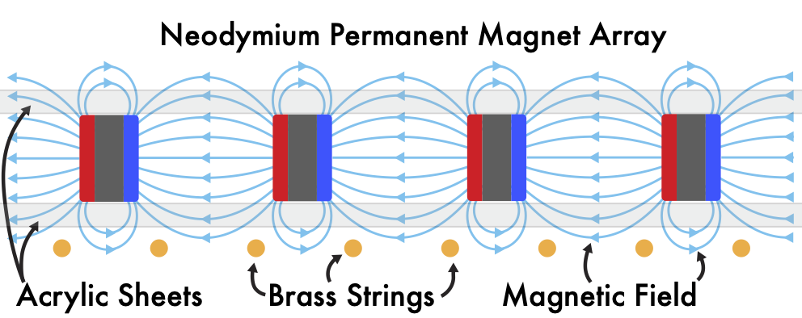

# Sparksichord_NIME2025
 A repo for schematics, CAD, and audiovisual examples to accompany the NIME 2025 Sparksichord conference paper by Adam Schmidt, Jeffrey Snyder, Gian Torrano Jacobs, Joseph Gascho, Joyce Chen, and Andrew McPherson.

 Primary contact: a.schmidt24@imperial.ac.uk

The Sparksichord is a practical implementation of a 4-octave/48-channel Lorentz Force feedback sustainer system using brass strings, permanent magnets, optical sensors, and custom analog electronics. The Sparksichord is an augmentation of a 1970’s Zuckermann ‘Z-Box’ Harpsichord and uses its own keyboard to control the volume of each string’s feedback/actuation. Here we provide a basic overview of the working principles of the Sparksichord. For a more comprehensive guide to Lorentz Force actuation, please see _The Sparksichord: Practical Implementation of a Lorentz Force Electromagnetic Actuation and Feedback System_.

# Lorentz Force
The cumulative force felt by a charged particle exposed to electric and magnetic fields is known as the _Lorentz Force_. A special case of the Lorentz Force (sometimes referred to as the _Laplace Force_) describes the magnetic force felt by a current-carrying wire exposed to a magnetic field:

$$
\begin{align}
 \mathbf{F} = I \mathbf{L} \times \mathbf{B}
\end{align}
$$

where $\mathbf{F}$ is the force vector felt by the wire, $I$ is the current through the wire, $\mathbf{B}$ is the magnetic field vector, and $\mathbf{L}$ is the length of the wire exposed to the magnetic field.

## Heat Buildup \& String Detuning
It is possible to drive a string with an oscillator tuned to match the string’s frequency, but doing so is not particularly effective. Depending on the material properties of the actuated string, some of the actuation current may be dissipated as heat in the string’s internal resistance, introducing thermal expansion of the string and causing it to lengthen and reduce its tension. This brings the frequency of the string down causing it to no longer match the frequency of the open-loop actuation signal.

The resistivity of some conductive metals are displayed in the figure below. Metals such as yellow and red brass are much less resistive than iron and steel, meaning they are more robust to string detuning, though it should be noted that heat treatment or work-hardening of the string material is also a factor, where annealed metal will typically have higher conductivity than a heat-treated metal. Heat-treating or other processes that increase the stength of a metal string are often required for strings to withstand the tensions typically found in musical instruments, so it is fair to assume any wire intended for stringing instruments will have slightly greater resistivity than in the figure below.

The intensity of detuning is proportional to its heat buildup and therefore proportional to the resistivity inherent to the string:
$$
\begin{align}
  Q = I^2Rt
\end{align}
$$
where $Q$ = heat buildup, $I$ = electric current, $R$ = resistance, and $t$ = time. Though this formula suggests that the string may heat up and continue to detune indefinitely as electric current is applied, there is an element of heat dissipation into the surrounding air and any other materials the string is in contact with.  In other words, for a real system, the detuning effect from heat buildup eventually finds equilibrium with the heat dissipation, stabilizing the tuning for a given electric current at a given room temperature.

# Lorentz Force Feedback via Optical Sensor
An optical sensor (in our case, the ITR20403) can be used to sense the string's position. If this signal is sent back into the string via a power amplifier, the string should begin to feedback.

On the Sparksichord, an array of 48 sensors was placed above the strings.

# Dynamic Control Via Amplitude Limitation
We can control the feedback volume by introducing a voltage-controlled limiter. On the Sparksichord, the limiter control signal can from the instrument's own keys (see next section), an onboard potentiometer, or an external control voltage source.

# Controlling Feedback with Keyboard
To capture how far each key is pressed (to set each limiter circuit's threshold value), we use an array of QRD1114 Optical sensors placed at the back of the keyboard:

# 12-Channel PCB
There are four of these 12-channel sustainer control boards on the Sparksichord:

# Magnet Placement
Running AC signal through a string doesn't make the string vibrate unless there is a magnetic field nearby. To create a relatively uniform magnetic field for all of the strings, we created a rail that holds 24 N52 Neodymium magnets in uniformly-spaced slots. The position of each magnet can be adjusted to find a desirable feedback timbre:

# Acknowledgements
This work was supported by a UKRI Frontier Research (Consolidator) grant (EP/X023478/1) “RUDIMENTS: Reflective Understanding of Digital Instruments as Musical Entanglements” and by the Royal Academy of Engineering under the Research Chairs and Senior Research Fellowships scheme.
Early development of this work was supported in part by the University of Michigan Organ Department, University of Michigan ArtsEngine Arts Integrative Interdisciplinary Research (AiiR) Grant, and the University of Michigan EXCEL Enterprise Grant.
