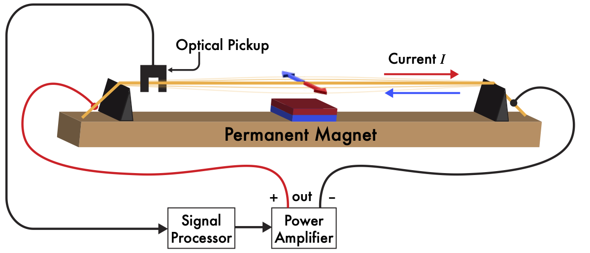

# Sparksichord_NIME2025
 A repo for schematics, CAD, and audiovisual examples to accompany the NIME 2025 Sparksichord conference paper by Adam Schmidt, Jeffrey Snyder, Gian Torrano Jacobs, Joseph Gascho, Joyce Chen, and Andrew McPherson.

 Primary contact: a.schmidt24@imperial.ac.uk

The Sparksichord is a practical implementation of a 4-octave/48-channel Lorentz Force feedback sustainer system using brass strings, permanent magnets, optical sensors, and custom analog electronics. The Sparksichord is an augmentation of a 1970’s Zuckermann ‘Z-Box’ Harpsichord and uses its own keyboard to control the volume of each string’s feedback/actuation. Here we provide a basic overview of the working principles of the Sparksichord. For a more comprehensive guide to Lorentz Force actuation, please see _The Sparksichord: Practical Implementation of a Lorentz Force Electromagnetic Actuation and Feedback System_.

# Lorentz Force
The cumulative force felt by a charged particle exposed to electric and magnetic fields is known as the _Lorentz Force_. A special case of the Lorentz Force (sometimes referred to as the _Laplace Force_) describes the magnetic force felt by a current-carrying wire exposed to a magnetic field:

$$
\begin{align}
 \mathbf{F} = I \mathbf{L} \times \mathbf{B}
\end{align}
$$

where $\mathbf{F}$ is the force vector felt by the wire, $I$ is the current through the wire, $\mathbf{B}$ is the magnetic field vector, and $\mathbf{L}$ is the length of the wire exposed to the magnetic field.

## Heat Buildup \& String Detuning

# Lorentz Force Feedback via Optical Sensor

# Controlling Feedback with Keyboard

